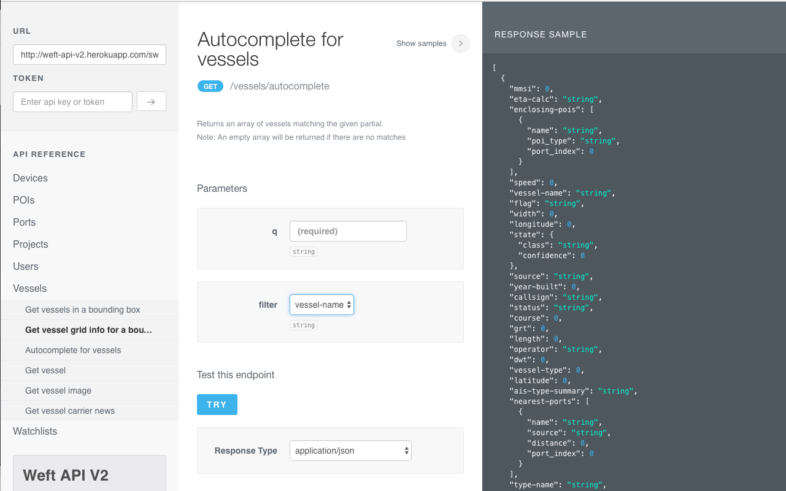

#### Trinity Montoya

1. neo4j visualization of one iteration of the shipping terminal identification prototype

2. Angular front-end + custom Canvas quad index implementation + realtime vessel data

3. Angular front-end + Leaflet geojson layers + d3 charts

4. SwaggerUI for Rails->Clojure API rewrite

